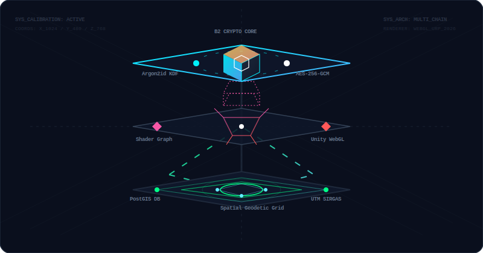

# Diego Henrique Oris de Roa Antunes (Diego Oris)
### **CTO • Web3 Architect • 3D Systems & Cryptography Engineer**

<p align="left">
  <a href="https://wa.me/5511974289097"></a>
  <a href="mailto:diegoantunes2301@gmail.com"></a>
  <a href="https://x.com/diegoorisderoa"></a>
  <a href="https://t.me/diegoorisderoa"></a>
</p>

---

I am a **CTO, Web3 Architect, and 3D Interactive Systems Engineer** with **6+ years of professional experience** delivering production-grade platforms globally (Switzerland, USA, Brazil). I specialize in designing and shipping mathematically secure cryptography systems, low-level blockchain protocols, scalable enterprise SaaS architectures, and high-performance **3D/WebGL simulation engines**. 

I bridge the gap between high-level business models and low-level bytecode execution, managing entire technical roadmaps from genesis blocks to hardware-accelerated 3D shaders.

---

## ⚡ Flagship Project: B2 Wallet
### **Multi-Chain Self-Custody Browser Extension & Mobile App (EVM, Solana, UTXO & Alt-Chains)**
> **Core Stack:** React, Vite, TypeScript, Ethers.js, WebCrypto API, Argon2id KDF, AES-256-GCM.  
> **Coverage:** EVM Layer-2s, Solana, UTXO chains, Tron, Waves, Stellar, Cardano, Polkadot, Monero, and Zcash.

*   **Defense-Grade Local Security:** Implemented a secure key derivation and storage system utilizing **Argon2id KDF** to protect seed phrases against high-performance GPU-based brute-force attacks, combined with authenticated **AES-256-GCM block ciphers** for encrypting the local state.
*   **Performance:** Fluid, hardware-accelerated UI transitions, a multi-currency responsive SVG dashboard, and real-time smart contract diagnostic engines tracking transaction payloads.
*   **Repository:** [View B2 Wallet](https://github.com/D-H-O-R-A/b2-wallet)

---

## 🎮 3D Engineering & Spatial Computing

I design high-performance interactive 3D simulations, real-time spatial cartography compilers, and custom game engines, targeting WebGL, desktop, and mobile environments.

<p align="center">
  
</p>


### 🗺️ [pdf-to-maps](https://www.npmjs.com/package/pdf-to-maps) — Real-Time 3D WebGL Cartography Compiler
*   **The Pipeline:** Parses georeferenced land deed PDFs (SIGEF/INCRA) offline, resolves high-precision polygon closure constraints, performs ellipsoidal geodetic conversions (SIRGAS2000 UTM Projections), and compiles **interactive 3D WebGL isometric models** on-the-fly.
*   **Advanced Graphics:** Renders detailed 3D terrain boundaries, height maps, and spatial meshes in the browser utilizing **Three.js** and WebGL, alongside AutoCAD-compliant DXF CAD layouts and QGIS-compliant GeoJSON schemas.
*   **DevOps:** Built with strict GitHub Actions CI/CD and **SLSA Level 3 Provenance** for secure, signed NPM package delivery.

### 🧩 Match Blocks MVP — Unity 2D/3D Gameplay Engine
*   **The Architecture:** Candy-crush style match game custom-built on a data-driven, strictly decoupled FSM (Finite State Machine) loop and global Event Bus to keep graphics rendering isolated from mathematical match resolution.
*   **Visual Juice & VFX:** Implemented custom **Shader Graph** effects for high-end rendering transitions, procedural particle generators, DOTween custom animations, and an asset-streaming system utilizing **Unity Addressables**.
*   **Stack:** Unity 2022 LTS, C#, Universal Render Pipeline (URP), Object Pooling, Seeded Deterministic RNG, Unity Ads/IAP/Analytics.

---

### 🏛️ [Parque Arqueológico de São João Marcos](https://www.saojoaomarcos.com.br/) — Interactive 3D Historical Reconstruction & Virtual Museum
*   **The Project:** Collaborated as the lead developer to create an interactive georeferenced virtual museum for the first archaeological park in Brazil (São João Marcos, Rio de Janeiro). Reconstructed the entire historical 18th-century town flooded in the 1940s into a high-fidelity interactive digital environment.
*   **The Engineering:** Programmed the real-time 3D environments, spatial mapping coordinates, highly optimized WebGL/mobile layouts, georeferenced terrain meshes, and interactive building nodes. Enabled visitors to virtually walk through reconstructed ruins and historical landmarks with rich historical overlays.
*   **Stack:** Unity 3D, C#, WebGL, Three.js, Custom Shaders, Georeferenced Terrain Meshes, Spatial Mapping.

---

## 🚀 Recent Enterprise Deployments (2026)

### ⚖️ [Solucione Multas](https://solucionemultas.com.br/) — Legal Tech Enterprise SaaS Ecosystem
*   **The Venture:** Co-founded and built from the ground up as CTO, owning the complete technical roadmap.
*   **The Architecture:** Unifies a high-converting public landing portal, a secure dedicated Client Area (User Portal) for case tracking, and a centralized administrative telemetry control panel.
*   **Automation:** Built an automated conversational chatbot via the WhatsApp Business API that executes initial user triage and feeds structured data directly into backend systems.
*   **Stack:** React + Vite, TypeScript, TailwindCSS, Firebase (Firestore Real-time Sync, Cloud Functions, Auth, FCM), Facebook Conversions API.

### 👼 [Anjo Online](https://anjoonline.com.br/) — Philanthropic Memorial SaaS
*   **The System:** A compassionate virtual memorial and real-time ceremony streaming SaaS built for absolute data privacy and global performance.
*   **Regional Payment Gateways:** Custom payment gateway routing using Mercado Pago for Brazil and **Swiss TWINT** for operations in Switzerland.
*   **Infrastructure:** Engineered a NestJS backend deployed on containerized Google Cloud Run nodes, syncing via Redis caching and PostgreSQL ACID-compliant databases.
*   **Stack:** Next.js, React, TypeScript, Node.js, NestJS, PostgreSQL, Redis, Google Cloud Run, Firebase Cloud Messaging (FCM), i18n (6 languages).

### 📱 [Click Serviços](https://clickservico.com/) — Enterprise Multi-Platform Marketplace
*   **The System:** A complete service marketplace connecting verified local service professionals with users through one-tap bookings and real-time messaging.
*   **The Architecture:** Combines responsive Next.js administrative dashboards and high-performance native iOS and Android applications compiled with Flutter.
*   **Geospatial Queries:** Backed by NestJS on Google Cloud Run utilizing a PostgreSQL database with **PostGIS** for real-time spatial geolocation queries.
*   **Stack:** Flutter, Next.js, React, TypeScript, NestJS, PostgreSQL, PostGIS, Google Cloud Run, Redis, Mercado Pago.

---

### 🌱 [Young Market](https://www.youngmarket.com.br/) — Custom Blockchain Core & Athlete Crowd-Tokenization MVP
*   **The Venture:** Served as **Founding CTO** (Equity Partner), designing and building the initial MVP from the ground up.
*   **The Architecture:** Developed a proprietary blockchain core on top of the Waves network. Designed and programmed custom smart contracts in Ride, implemented atomic swap interoperability bridges to Ethereum, and engineered athlete image-rights tokenization mechanics.
*   **Integrations:** Developed a custom mobile application interface, integrated Stripe, and built a custom payment gateway for direct fiat-to-token purchases. Pivoted the core system mechanics to comply with Brazilian CVM crowdfunding regulations.
*   **Stack:** Waves Core Basis, Ride, React Native, TypeScript, Node.js, Stripe, CVM Compliance.

---

## 🛠️ Main Tech Ecosystem

```yaml
Blockchain & Web3: Solidity (0.8.x), Smart Contracts (EVM), Hardhat, Foundry, Ethers.js, viem, Web3.js, Waves Core, Ride, BIP39/BIP44, Gnosis Safe
3D & Game Engines: Unity 3D/2D (C#), Unreal Engine, WebGL, URP, HDRP, HLSL Shaders, Three.js, Proj4.js, DOTween, Addressables
Backend & APIs:    Node.js, NestJS, Express, Python, FastAPI, Go, Rust, C#, C++, RESTful APIs, GraphQL, gRPC, WebSockets, BullMQ
AI & Data Science: Python, TensorFlow, PyTorch, LangChain (RAG), LlamaIndex, OpenAI API, LLMs, pgvector, Pinecone, Pandas
Databases & Cache: PostgreSQL, PostGIS (Geolocalização), MongoDB, Redis, MySQL, SQLite, Prisma, Supabase, Cloud Firestore
Nuvem & DevOps:    AWS (ECS, RDS, KMS), GCP (Google Cloud Run), Docker, Kubernetes, CI/CD (GitHub Actions), Terraform, Prometheus, Grafana, Cloudflare
Frontend & Mobile: Next.js 14, React, TypeScript, HTML5/CSS3, TailwindCSS, Vite, Redux, Zustand, Framer Motion, Flutter, React Native, PWA
Security & Testing: WebCrypto API, Argon2id, OAuth2, JWT, AES-256-GCM, Jest, Vitest, Cypress, Playwright, Slither, Echidna, OSSF SLSA 3
```

---

## 📈 Analytics & GitHub Stats

<p align="left">
  
  
</p>

---

## 🔄 Recent GitHub Activity & Commits
<!-- START_SECTION:activity -->
#### 🛠️ Recent Contributions
- **b2-wallet:** Refactored complete application event listeners; modularized `app-events-modals.js` and `app-events-config.js` (~3,700 lines optimized)
- **b2-wallet:** Created recursive codebase architecture markdown documentation under `src/js/README.md`
- **pdf-to-maps:** Optimized coordinates conversion algorithms utilizing geodetic projections (SIRGAS2000)
- **b2-wallet:** Added robust multi-wallet routing with bip39 keychain configuration
- **click-servicos-app:** Optimized PostGIS geolocation query parameters on Google Cloud Run NestJS backend
<!-- END_SECTION:activity -->


---

## 💬 Get in Touch

I partner with teams to architect secure Web3 protocols, high-performance backends, and interactive 3D/simulation environments.

*   💬 **WhatsApp:** [+55 (11) 97428-9097](https://wa.me/5511974289097)
*   📧 **Direct Email:** [diegoantunes2301@gmail.com](mailto:diegoantunes2301@gmail.com)
*   🐦 **X (Twitter):** [@diegoorisderoa](https://x.com/diegoorisderoa)
*   ✈️ **Telegram:** [@diegoorisderoa](https://t.me/diegoorisderoa)
*   📝 **Medium Articles:** [@diegoorisderoa](https://medium.com/@diegoorisderoa)
